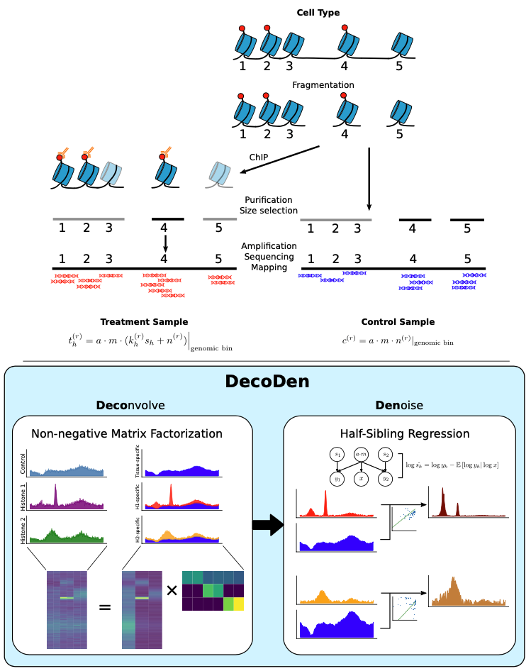

# Multi-histone ChIP-Seq Analysis with DecoDen
[](https://doi.org/10.1101/2022.10.18.512665)




DecoDen uses replicates and multi-histone ChIP-Seq experiments for a fixed cell type to learn and remove shared biases from fragmentation, PCR amplification and seqeunce mappability. 

Details about DecoDen are in the paper [**Multi-histone ChIP-Seq Analysis with DecoDen**](https://www.biorxiv.org/content/10.1101/2022.10.18.512665v1).


## Dependencies
DecoDen depends on MACS2, BEDOPS and BEDTools for data pre-processing.
```sh
conda install -c bioconda macs2 bedops bedtools
```

## Quick Start
### Prepare data
Create a CSV file with details about samples. DecoDen expects aligned reads in BED/BAM format.  The sample CSV file must contain `filepath`, `exp_name` and `is_control` columns. For an example look under [`utils/samples.csv`](https://github.com/ntanmayee/DecoDen/blob/main/utils/samples.csv). 

### Running DecoDen
Run DecoDen with the following command. 

```bash
python run.py -i samples.csv -o results_dir
```

The output from DecoDen will be written into `HSR_results.ftr` in the output directory. To inspect results - 

```python
import pandas as pd
hsr_results = pd.read_feather('HSR_results.ftr')
```

#### List of options
| Parameter | Description |
|---|---|
| `-i INPUT_CSV, --input_csv` | path to CSV file with information about experimental conditions. Must contain `filepath`, `exp_name` and `is_control` columns. Control/input should be the first condition. Input files can be in BED/BAM format. |
| `-bs BIN_SIZE, --bin_size BIN_SIZE` | size of genomic bin for tiling. Recommended value is 10-200. Smaller bin size increases space and runtime, larger binsizes may occlude small variations. Default: 200 |
| `-n NUM_JOBS, --num_jobs NUM_JOBS` | Number of parallel jobs for preprocessing. Default: 1 |
| `-o OUT_DIR, --out_dir OUT_DIR` | path to directory where all output files will be written |
| `-bl BLACKLIST_FILE, --blacklist_file BLACKLIST_FILE` | path to blacklist file |
| `--control_cov_threshold CONTROL_COV_THRESHOLD` | Threshold for coverage in control samples. Only genomic bins above this threshold will be used. It is recommended to choose a value larger than 1/bin_size. |
| `--n_train_bins N_TRAIN_BINS` | Number of genomic bins to be used for training |
| `--chunk_size CHUNK_SIZE` | Chunk size for processing the signal matrix. Should be smaller than `n_train_bins` |
| `--seed SEED` | Random state for reproducability |
| `--alpha_W ALPHA_W` | Regularisation for the signal matrix |
| `--alpha_H ALPHA_H` | Regularisation for the mixing matrix |

## Running DecoDen

If you would prefer to run preprocessing and DecoDen separately, use the following commands.

### Preprocessing
Pre-processing includes removing duplicate reads, extending reads and tiling the data into bins. These steps require MACS2, BEDOPS and BEDTools.

```bash
python run_preprocess.py -i "samples.csv" \ # CSV file with filepath and conditions
                         -o "output_directory" \ # directory for preprocessed files
                         -bs 200 \ # bin size for tiling (default 200)
                         -n 2 \ # number of jobs for parallelization (default 1)
```
The sample CSV file should contain `filepath`, `exp_name` and `is_control` columns. For an example look under `utils/samples.csv`. Preprocessed data will be written to `data` folder in the output directory.

### Running DecoDen

To run DecoDen, the data must be preprocessed into bedGraph format and binned correctly. The algorithm requires a `json` file that indicates the correspondance of each file to the experimental condition.

**If you used `DecoDen` for preprocessing, this file is automatically generated for you. It will called `experiment_conditions.json` in the output folder.**

```javascript
{
    "control_1.bdg": "control",
    "control_2.bdg": "control",
    "h3k27me3_1.bdg": "H3K27me3",
    "h3k27me3_2.bdg": "H3K27me3",
    "h3k27me3_3.bdg": "H3K27me3",
    "h3k4me3_1.bdg": "H3K4me3",
    "h3k4me3_2.bdg": "H3K4me3",
    "h3k4me3_3.bdg": "H3K4me3"
}
```

To run DecoDen, an example command would be:
```bash
python run_decoden --data_folder "data/my_experiment" \ # where the .bdg files are saved
                   --output_folder "outputs/my_experiment_results" \ # where to save the results
                   --files_reference "data/my_experiment_files.json" \ # the aforementioned mapping
                   --blacklist_file "data/annotations/hg19-blacklist.v2.bed" \
                   --conditions "control" "H3K27me3" "H3K4me3" \ # Ordering of the experimental conditions. The first one must be the control.
                   --control_cov_threshold 1.0 \ # Minimum coverage for the training data for the NMF
                   --n_train_bins 300000 \ # Number of training bins for the extraction of the mixing matrix
                   --chunk_size 100000 \ # For the processing of the signal matrix
                   --seed 42 \ # Random state for reproductibility
                   --alpha_W 0.01 \ # Regularisation for the signal matrix
                   --alpha_H 0.001 \ # Regularisation for the mixing matrix

```

Results are written to `HSR_results.ftr` in the output directory. NMF signal matrix and mixing matrix are in `NMF`. For a sanity check, you can inspect the figures `mixing_matrix.pdf` and `signal_matrix_sample.pdf`. 

## Bug Reports and Suggestions for Improvement
Please [raise an issue](https://github.com/ntanmayee/DecoDen/issues/new) if you find bugs or if you have any suggestions for improvement.
